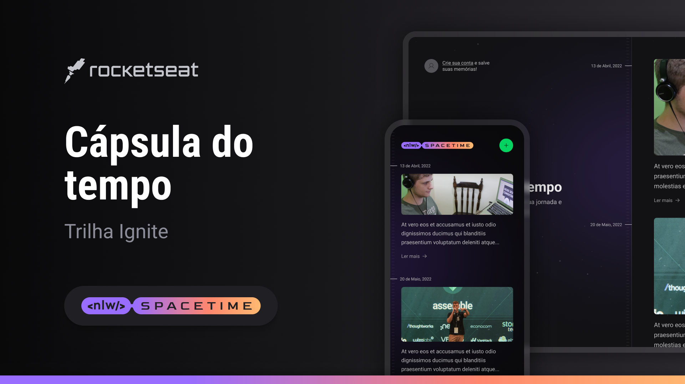

# NLW-Spacetime

## About:

Project developed during NLW 12, produced by Rocketseat, a memory recall application, where the user can add texts, photos and videos of important events in his life to a timeline, organized by month and year.

Projeto desenvolvido durante o NLW 12, produzido pela Rocketseat, aplicação de recordação de memórias, onde o usuário pode adicionar à uma timeline textos, fotos e vídeos de acontecimentos marcantes da sua vida, organizados por mês e ano.

## Technologies:
* Back-end: NodeJs,Typescript, Prisma, Fastify, Zod, SQLite
* Front-end: TypeScript, React, NextJs, TailwindCSS, Axios
* Mobile: React Native, Expo, NativeWind

## Features: 
### Back-end:
* Github oauth, JWT
* CRUD
* Entity Relationship Diagram(ERD):

## How to execute:

In all projects, when accessing the folder, it is necessary to download the packages with the manager of your choice.

Access the documentation for each project:
- [Backend](./server/README.md)
- [Web](./web/README.md)
- [Mobile](./mobile/README.md)

## Layout:
The project layout was developed by Rocketseat and is available in the link below:

- [Layout]([https://www.figma.com/community/file/1169028343875283461](https://www.figma.com/file/TS2JiV9SOi67fcvoz3Ne1U/C%C3%A1psula-do-tempo-%E2%80%A2-Trilha-Ignite-(Community)?type=design&node-id=205%3A3&mode=design&t=xGJkzkH3v2LDqMAX-1))

## Contact:

Contact me by email or through my Linkedin.

## 📝 License

This project under MIT license. See [LICENSE](LICENSE.md) for more details.

---

<h5 align="center">
  &copy;2022 - <a href="https://github.com/rafael-dias-moura">Rafael Dias</a>
</h5>

 
